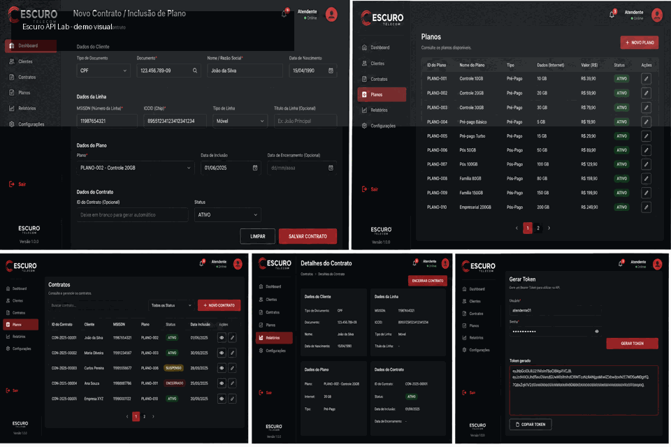

# Escuro API Lab

API REST e interface web fictícias para simular operações de atendimento em planos digitais. O projeto foi criado para demonstrar organização de backend, documentação Swagger, testes manuais com Postman e um front-end operacional consumindo a API.

> Todos os dados, usuários, documentos, contratos e credenciais mostrados neste repositório são fictícios e servem apenas para execução local.

## Demonstração



O GIF acima usa a interface local fictícia do projeto para mostrar o fluxo visual esperado. Ele não contém dados reais, clientes, endpoints corporativos ou credenciais.

## Funcionalidades

* API REST com Node.js, TypeScript, Fastify, Prisma e SQLite.
* Autenticação local via Bearer Token.
* Swagger disponível em `/docs`.
* Coleção Postman com cenários positivos e negativos.
* Front-end para consulta, criação e encerramento de contratos fictícios.
* Regras de validação para dados de cliente, linha, plano e contrato.

## Stack

| Camada | Tecnologias |
| --- | --- |
| Backend | Node.js, TypeScript, Fastify, Prisma, SQLite |
| Frontend | React, Vite, TypeScript |
| QA/API | Swagger, Postman, cenários de erro e validações |
| Dados | Seeds e banco local fictício |

## Arquitetura

```text
frontend/  Interface web operacional
backend/   API, autenticação, validações, banco local e Swagger
postman/   Collection e environment local de testes
docs/      Regras, fases, referências visuais e decisões do projeto
scripts/   Scripts auxiliares para execução local
```

Fluxo principal:

```text
Frontend React
      |
      v
Fastify API -> Prisma -> SQLite local
      |
      v
Swagger + Postman para validação manual
```

## Como executar

Crie o arquivo local de ambiente a partir do exemplo:

```bash
cd backend
cp .env.example .env
```

Instale e suba o backend:

```bash
npm install
npm run db:init
npm run seed
npm run dev
```

Em outro terminal, suba o frontend:

```bash
cd frontend
npm install
npm run dev
```

Acessos locais:

```text
API:      http://localhost:3333
Swagger:  http://localhost:3333/docs
Frontend: http://localhost:3000
```

## Como testar

* Abra o Swagger em `http://localhost:3333/docs`.
* Gere um token local usando os dados fictícios carregados pelo seed.
* Importe a collection em `postman/Escuro_API.postman_collection.json`.
* Use o environment local em `postman/Escuro_Local.postman_environment.json`.
* Rode cenários de sucesso, token inválido, ausência de token, duplicidade e contrato inexistente.

Credenciais reais não devem ser usadas neste projeto. Configure apenas valores locais e fictícios no `.env`.

## O que este projeto demonstra

* Modelagem de uma API com contrato claro e documentação Swagger.
* Separação entre frontend, backend, banco local e artefatos de teste.
* Validações de entrada e respostas padronizadas de erro.
* Uso de Postman para apoiar testes exploratórios e regressivos.
* Criação de um sistema fictício seguro para demonstração de QA e desenvolvimento web.

## Próximos passos

* Adicionar GIF real do fluxo local.
* Expandir testes automatizados no backend.
* Adicionar testes de interface ou API em pipeline.
* Melhorar exemplos da collection Postman com massa 100% fictícia.
